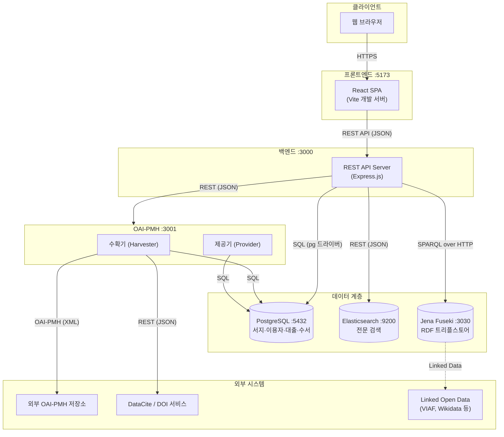
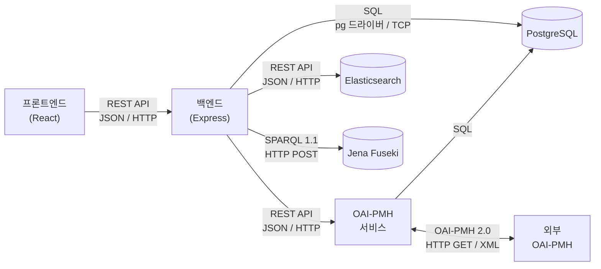
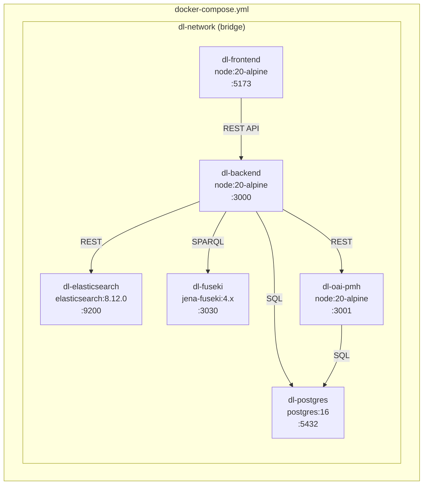

# 대학도서관 디지털도서관 시스템 아키텍처

## 1. 시스템 개요

### 목적

대학도서관의 물리적 장서, 전자자원, 연구데이터를 통합 관리하고,
이용자에게 검색·대출·메타데이터 활용 서비스를 제공하는 디지털도서관 시스템을 구축한다.

### 범위

- 도서(서지 레코드) 및 소장 항목의 등록·검색·대출 관리
- 전자자원(e-journal, e-book, DB) 구독 관리
- DataCite Metadata Schema 4.x 기반 연구데이터 메타데이터 관리
- Linked Data(RDF/SPARQL) 기반 시맨틱 서비스
- OAI-PMH 프로토콜을 통한 외부 기관과의 메타데이터 상호운용
- MARC, Dublin Core, DataCite 등 다중 메타데이터 스키마 지원
- 수서(Acquisitions) 업무 관리

---

## 2. 전체 아키텍처 다이어그램



---

## 3. 구성 요소별 설명

### 3.1 프론트엔드 (React)

| 항목 | 내용 |
|------|------|
| 프레임워크 | React 18+ (SPA) |
| 빌드 도구 | Vite |
| 상태 관리 | React Query (서버 상태), Context API (UI 상태) |
| HTTP 클라이언트 | Axios |
| 주요 화면 | 통합 검색, 서지 상세, 대출 현황, 전자자원 브라우징, 연구데이터 브라우징, 관리자 대시보드 |
| 라우팅 | React Router v6 |

### 3.2 백엔드 (Node.js + Express)

| 항목 | 내용 |
|------|------|
| 런타임 | Node.js 20 LTS |
| 프레임워크 | Express.js 4.x |
| DB 드라이버 | pg (node-postgres) |
| 유효성 검사 | express-validator |
| 인증 | JWT 기반 인증/인가 |
| API 문서 | Swagger / OpenAPI 3.0 |
| 주요 모듈 | 서지 관리, 소장 관리, 이용자 관리, 대출 관리, 수서 관리, 전자자원 관리, 연구데이터 관리, 메타데이터 변환, SPARQL 프록시 |

### 3.3 OAI-PMH 서비스 (Node.js + Express)

| 항목 | 내용 |
|------|------|
| 런타임 | Node.js 20 LTS |
| 프레임워크 | Express.js 4.x |
| 포트 | 3001 |
| 프로토콜 | OAI-PMH 2.0 |
| 소스 | `oai-pmh/` 디렉토리 |
| 수확기 (Harvester) | 외부 기관 OAI-PMH 저장소에서 메타데이터를 주기적으로 수확하여 PostgreSQL에 저장 |
| 제공기 (Provider) | 본 시스템의 메타데이터를 OAI-PMH 엔드포인트(`/oai`)로 외부에 노출 |
| 지원 포맷 | Dublin Core (`oai_dc`), DataCite Metadata Schema |
| 지원 Verb | `Identify`, `ListMetadataFormats`, `ListSets`, `ListIdentifiers`, `ListRecords`, `GetRecord` |
| 스케줄링 | Node.js cron 기반 주기적 수확 |
| DB 접근 | PostgreSQL (pg 드라이버) — 수확한 메타데이터 저장, 제공할 레코드 조회 |

### 3.4 데이터베이스 (PostgreSQL)


| 항목 | 내용 |
|------|------|
| 버전 | PostgreSQL 16 |
| 역할 | 서지 레코드, MARC 필드, 저자, 주제, 이용자, 소장 항목, 대출, 수서 등 핵심 엔티티의 영구 저장소 |
| 스키마 | `database/schema.sql` 참조 |
| 초기 데이터 | `database/init/` SQL 스크립트, `database/sample_data.sql` |
| ER 다이어그램 | `docs/erd.md` 참조 |

**주요 테이블:**

| 테이블 | 설명 |
|--------|------|
| `bib_records` | 서지 레코드 (MARC 핵심 필드: 제어번호, ISBN, 표제, 발행처 등) |
| `marc_fields` | MARC EAV 테이블 (tag/ind/subfield 구조, 서지 레코드의 확장 필드) |
| `authors` | 저자 (개인/단체, ORCID 포함) |
| `bib_authors` | 서지-저자 연결 (M:N, role: main/added) |
| `subjects` | 주제명 (LCSH, DDC, KDC, MeSH) |
| `bib_subjects` | 서지-주제 연결 (M:N) |
| `users` | 이용자 (학생/교직원/직원) |
| `items` | 소장 항목 (바코드, 위치, 상태) |
| `loans` | 대출 이력 |
| `acquisitions` | 수서 (주문/입수/정리) |

### 3.5 검색엔진 (Elasticsearch)

| 항목 | 내용 |
|------|------|
| 버전 | Elasticsearch 8.12 |
| 역할 | 서지 레코드, 전자자원, 연구데이터의 전문 검색 및 패싯 검색 |
| 인덱스 | `bib_records`, `e_resources`, `datasets` |
| 동기화 | 백엔드에서 PostgreSQL 변경 시 Elasticsearch에 동기 인덱싱 |
| 설정 | single-node, xpack.security 비활성화 (개발 환경) |
| 한글 분석 | nori 형태소 분석기 플러그인 |

### 3.6 트리플스토어 (Apache Jena Fuseki)

| 항목 | 내용 |
|------|------|
| 버전 | Apache Jena Fuseki 4.x |
| 역할 | RDF 트리플 저장 및 SPARQL 질의 엔드포인트 제공 |
| 데이터셋 | `/ds` (기본 데이터셋) |
| 질의 | SPARQL 1.1 Query / Update |
| 활용 | 서지·저자·주제 간 시맨틱 관계, Linked Open Data 연계 (VIAF, Wikidata), DataCite RDF 매핑 |
| 설정 | `triplestore/` 디렉토리 |

---

## 4. 구성 요소 간 통신 방식



| 출발 | 도착 | 프로토콜 | 데이터 형식 | 포트 |
|------|------|----------|-------------|------|
| 프론트엔드 (React) | 백엔드 (Express) | REST API (HTTP) | JSON | 3000 |
| 백엔드 (Express) | OAI-PMH 서비스 | REST API (HTTP) | JSON | 3001 |
| 백엔드 (Express) | PostgreSQL | SQL (TCP) | pg 바이너리 프로토콜 | 5432 |
| 백엔드 (Express) | Elasticsearch | REST API (HTTP) | JSON | 9200 |
| 백엔드 (Express) | Jena Fuseki | SPARQL over HTTP (POST/GET) | RDF/XML, JSON-LD, Turtle | 3030 |
| OAI-PMH (수확기) | 외부 OAI-PMH | OAI-PMH 2.0 (HTTP GET) | XML (Dublin Core, DataCite) | 80/443 |
| 외부 시스템 | OAI-PMH (제공기) | OAI-PMH 2.0 (HTTP GET) | XML (Dublin Core, DataCite) | 3001 |
| OAI-PMH 서비스 | PostgreSQL | SQL (TCP) | pg 바이너리 프로토콜 | 5432 |

---

## 5. 포트 번호 정의표

| 서비스 | 컨테이너 이름 | 내부 포트 | 호스트 포트 | 비고 |
|--------|---------------|-----------|-------------|------|
| React 개발 서버 | dl-frontend | 5173 | 5173 | Vite 기본 포트 |
| Express REST API | dl-backend | 3000 | 3000 | 백엔드 REST API |
| OAI-PMH 서비스 | dl-oai-pmh | 3001 | 3001 | 수확기 + 제공기 (`/oai`) |
| PostgreSQL | dl-postgres | 5432 | 5432 | 관계형 데이터베이스 |
| Elasticsearch | dl-elasticsearch | 9200 | 9200 | 검색 엔진 REST API |
| Jena Fuseki | dl-fuseki | 3030 | 3030 | SPARQL 엔드포인트 |

---

## 6. Docker 컨테이너 구성

### 컨테이너 구성도



### 컨테이너 상세

| 컨테이너 | 이미지 | 볼륨 | 의존성 |
|-----------|--------|------|--------|
| dl-frontend | node:20-alpine | `./frontend:/app` | dl-backend |
| dl-backend | node:20-alpine | `./backend:/app` | dl-postgres, dl-elasticsearch, dl-fuseki, dl-oai-pmh |
| dl-oai-pmh | node:20-alpine | `./oai-pmh:/app` | dl-postgres |
| dl-postgres | postgres:16 | `postgres_data:/var/lib/postgresql/data`, `./database/init:/docker-entrypoint-initdb.d` | — |
| dl-elasticsearch | elasticsearch:8.12.0 | `es_data:/usr/share/elasticsearch/data` | — |
| dl-fuseki | jena-fuseki:4.x | `fuseki_data:/fuseki`, `./triplestore:/config` | — |

### 환경변수

| 변수 | 서비스 | 용도 |
|------|--------|------|
| `POSTGRES_DB` | dl-postgres | 데이터베이스 이름 |
| `POSTGRES_USER` | dl-postgres | 데이터베이스 사용자 |
| `POSTGRES_PASSWORD` | dl-postgres | 데이터베이스 비밀번호 |
| `DATABASE_URL` | dl-backend | PostgreSQL 접속 문자열 |
| `ELASTICSEARCH_URL` | dl-backend | Elasticsearch 접속 URL |
| `FUSEKI_URL` | dl-backend | Jena Fuseki SPARQL 엔드포인트 URL |
| `OAI_PMH_URL` | dl-backend | OAI-PMH 서비스 접속 URL |
| `JWT_SECRET` | dl-backend | JWT 서명 키 |
| `DATABASE_URL` | dl-oai-pmh | PostgreSQL 접속 문자열 |
| `OAI_REPOSITORY_NAME` | dl-oai-pmh | OAI-PMH 저장소 이름 |
| `OAI_BASE_URL` | dl-oai-pmh | OAI-PMH 제공기 기본 URL |
| `OAI_ADMIN_EMAIL` | dl-oai-pmh | OAI-PMH 관리자 이메일 |
| `discovery.type` | dl-elasticsearch | `single-node` (개발 환경) |
| `xpack.security.enabled` | dl-elasticsearch | `false` (개발 환경) |
| `ES_JAVA_OPTS` | dl-elasticsearch | JVM 힙 메모리 설정 (`-Xms512m -Xmx512m`) |

### 볼륨

| 볼륨 이름 | 컨테이너 마운트 경로 | 용도 |
|-----------|---------------------|------|
| `postgres_data` | `/var/lib/postgresql/data` | PostgreSQL 데이터 영속화 |
| `es_data` | `/usr/share/elasticsearch/data` | Elasticsearch 인덱스 영속화 |
| `fuseki_data` | `/fuseki` | Jena Fuseki RDF 데이터 영속화 |

### 서비스 시작 순서

```
dl-postgres  ─┬─→ dl-oai-pmh ─┐
              │                │
dl-elasticsearch ─┤                ├─→ dl-backend ─→ dl-frontend
              │                │
dl-fuseki  ─┴────────────────┘
```

1. PostgreSQL, Elasticsearch, Jena Fuseki가 먼저 기동된다.
2. OAI-PMH 서비스가 PostgreSQL 기동 후 시작된다.
3. 백엔드가 모든 데이터 계층 + OAI-PMH 서비스 기동 후 시작된다.
4. 프론트엔드가 백엔드 API 준비 후 마지막으로 기동된다.
