# 대학도서관 디지털도서관 시스템 ER 다이어그램

도서(Book), 전자자원(EResource), 연구데이터(Dataset)를 통합 관리하는 디지털도서관 시스템의 ERD.
DataCite Metadata Schema 4.x의 Creator, Subject, FundingReference, RelatedIdentifier 항목을 반영함.

```mermaid
erDiagram
    User {
        int user_id PK
        string name
        string email
        string phone
        string affiliation
        date join_date
    }

    Book {
        string isbn PK
        string title
        string author
        string publisher
        int pub_year
        string call_number
        string location
    }

    Loan {
        int loan_id PK
        int user_id FK
        string isbn FK
        date loan_date
        date due_date
        date return_date
        string status
    }

    EResource {
        int id PK
        string title
        string resource_type
        string provider
        string platform_url
        string status
    }

    Dataset {
        int dataset_id PK
        string title
        string doi
        string version
        string license
        string format
        bigint size
        string access_rights
        int publication_year
    }

    Metadata {
        int meta_id PK
        string schema_type
        string field_name
        string field_value
        string language
    }

    Author {
        int author_id PK
        string name
        string affiliation
        string orcid
    }

    Subject {
        int subject_id PK
        string term
        string scheme
    }

    FundingReference {
        int funding_id PK
        int dataset_id FK
        string funder_name
        string award_number
    }

    BookAuthor {
        string isbn FK
        int author_id FK
    }

    BookSubject {
        string isbn FK
        int subject_id FK
    }

    DatasetAuthor {
        int dataset_id FK
        int author_id FK
        string role
    }

    DatasetSubject {
        int dataset_id FK
        int subject_id FK
    }

    DatasetBookRelation {
        int dataset_id FK
        string isbn FK
        string relation_type
    }

    DatasetEResourceRelation {
        int dataset_id FK
        int resource_id FK
        string relation_type
    }

    %% User - Loan - Book (1:N)
    User ||--o{ Loan : "대출한다"
    Book ||--o{ Loan : "대출된다"

    %% Book - Author (M:N)
    Book ||--o{ BookAuthor : ""
    Author ||--o{ BookAuthor : ""

    %% Book - Subject (M:N)
    Book ||--o{ BookSubject : ""
    Subject ||--o{ BookSubject : ""

    %% Book - Metadata (1:N)
    Book ||--o{ Metadata : "메타데이터를 가진다"

    %% EResource - Metadata (1:N)
    EResource ||--o{ Metadata : "메타데이터를 가진다"

    %% Dataset - Author (M:N, Creator)
    Dataset ||--o{ DatasetAuthor : ""
    Author ||--o{ DatasetAuthor : "Creator"

    %% Dataset - Subject (M:N)
    Dataset ||--o{ DatasetSubject : ""
    Subject ||--o{ DatasetSubject : ""

    %% Dataset - Metadata (1:N)
    Dataset ||--o{ Metadata : "메타데이터를 가진다"

    %% Dataset - FundingReference (1:N)
    Dataset ||--o{ FundingReference : "연구비를 가진다"

    %% Dataset - Book (M:N, RelatedIdentifier)
    Dataset ||--o{ DatasetBookRelation : ""
    Book ||--o{ DatasetBookRelation : ""

    %% Dataset - EResource (M:N, RelatedIdentifier)
    Dataset ||--o{ DatasetEResourceRelation : ""
    EResource ||--o{ DatasetEResourceRelation : ""
```

## 개체(Entity) 설명

| 개체 | 설명 |
|------|------|
| **Book** | 도서관 소장 도서 (ISBN 기준 식별) |
| **User** | 도서관 이용자 (학생, 교직원 등) |
| **Loan** | 도서 대출 이력 |
| **EResource** | 전자자원 (e-journal, e-book, DB 등 구독 자원) |
| **Dataset** | 연구데이터 (DataCite Metadata Schema 4.x 기반) |
| **Metadata** | 자원별 메타데이터 필드 (MARC, DC, DataCite 등) |
| **Author** | 저자 / Creator (ORCID 식별자 포함) |
| **Subject** | 주제 분류 (DDC, LCC, KDC 등 scheme 지원) |
| **FundingReference** | 연구비 정보 (DataCite FundingReference) |

## 관계(Relationship) 설명

| 관계 | 유형 | 설명 |
|------|------|------|
| User → Loan → Book | 1:N | 이용자가 도서를 대출 |
| Book ↔ Author | M:N | 도서와 저자 (BookAuthor 연결 테이블) |
| Book ↔ Subject | M:N | 도서와 주제 (BookSubject 연결 테이블) |
| Book → Metadata | 1:N | 도서의 메타데이터 |
| EResource → Metadata | 1:N | 전자자원의 메타데이터 |
| Dataset ↔ Author | M:N | 연구데이터와 Creator (DatasetAuthor 연결 테이블, role 포함) |
| Dataset ↔ Subject | M:N | 연구데이터와 주제 (DatasetSubject 연결 테이블) |
| Dataset → Metadata | 1:N | 연구데이터의 메타데이터 |
| Dataset → FundingReference | 1:N | 연구데이터의 연구비 정보 (DataCite) |
| Dataset ↔ Book | M:N | RelatedIdentifier 기반 연관 관계 |
| Dataset ↔ EResource | M:N | RelatedIdentifier 기반 연관 관계 |

## DataCite 매핑 참고

- `Dataset.doi` → DataCite `Identifier` (identifierType=DOI)
- `Dataset.title`, `publication_year`, `version`, `license` → DataCite 필수/권장 필드
- `DatasetAuthor.role` → DataCite `contributorType` 또는 Creator 구분
- `Subject.scheme` → DataCite `subjectScheme` (DDC, LCC, MeSH 등)
- `FundingReference` → DataCite `fundingReferences` 블록
- `DatasetBookRelation`, `DatasetEResourceRelation` → DataCite `relatedIdentifiers` (relationType: IsSupplementTo, IsCitedBy 등)
